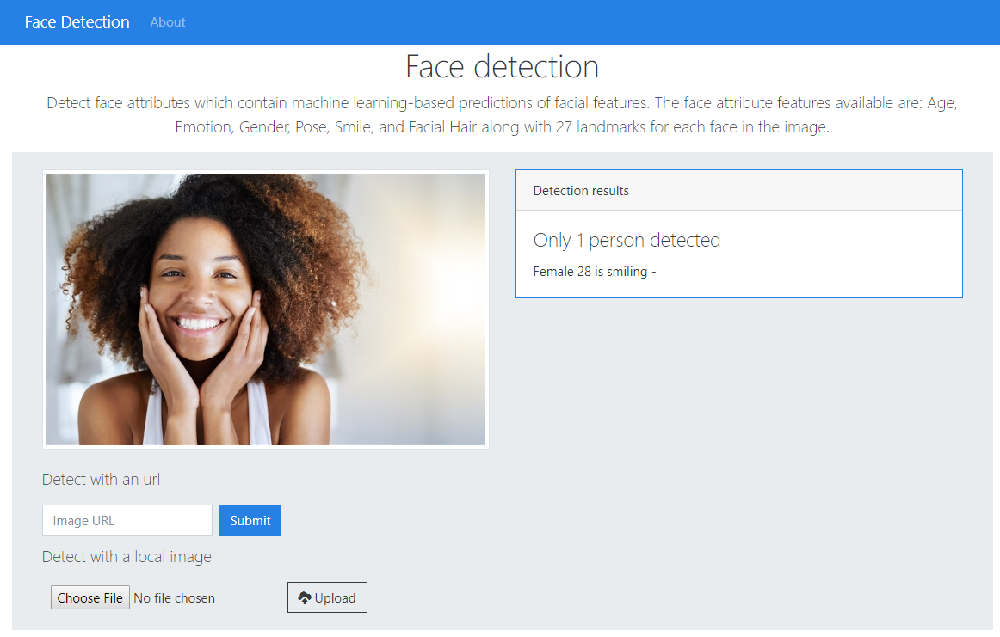

# Face Detection using Cognitive Service and ASP.Net MVC

This is a small sample application showing how to detect face attributes which contain machine learning-based predictions of facial features.

Built with C# 6 features, you must be running VS 2019 to compile.

Built with ASP.Net MVC

[](https://www.paypal.me/wilsondonations/5)





## Available content:

You can find the following content related to this sample:

* [Creating your free Azure account](https://azure.microsoft.com/en-us/free/)
* [Cognitive Services: Face](https://azure.microsoft.com/en-us/services/cognitive-services/face/)


## Setup
For security reasons I use a file called [Settings.cs.dist](/src/FaceDetectionClient/Settings.cs.dist) you must change their name to **AppSettings.cs** and complete with your credentials obtained in your azure account:

### Setting.cs.dist

```cs
public static class Settings
{
    public const string SubscriptionKey = "";
    public const string Endpoint = "";
    public static readonly FaceAttributeType[] FaceAttributes = {
        FaceAttributeType.Age,
        FaceAttributeType.Gender,
        FaceAttributeType.Emotion,
        FaceAttributeType.Hair,
        FaceAttributeType.Glasses,
        FaceAttributeType.Accessories,
        FaceAttributeType.Smile
    };
}
```


#### License
Licensed under MIT, [see license file](LICENSE)
